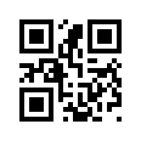
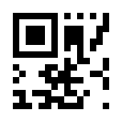
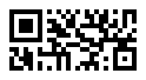

<!--
SPDX-FileCopyrightText: 2014 kennytm
SPDX-FileCopyrightText: 2020 Cabia Rangris
SPDX-FileCopyrightText: 2020 Isaac Parker
SPDX-FileCopyrightText: 2020 Vladimir Serov
SPDX-FileCopyrightText: 2024 Alexis Hildebrandt
SPDX-FileCopyrightText: 2024 Michael Spiegel
SPDX-FileCopyrightText: 2024 Shun Sakai

SPDX-License-Identifier: Apache-2.0 OR MIT
-->

# qrcode-rust2

[![CI][ci-badge]][ci-url]
[![Version][version-badge]][version-url]
![MSRV][msrv-badge]
[![Docs][docs-badge]][docs-url]
![License][license-badge]

**qrcode-rust2** ([`qrcode2`][version-url]) is a [QR code] encoding library
written in [Rust].

This crate provides a [normal QR code], [Micro QR code], and [rMQR code]
encoder for binary data.

> [!IMPORTANT]
> This is a fork of the [`qrcode`] crate.

## Usage

Run the following command in your project directory:

```sh
cargo add qrcode2
```

### Crate features

#### `eps`

Enables [EPS] rendering support. This is enabled by default.

#### `image`

Enables raster image rendering support powered by the [`image`] crate. This is
enabled by default.

#### `pic`

Enables [PIC] rendering support. This is enabled by default.

#### `std`

Enables features that depend on the standard library. This is enabled by
default.

#### `svg`

Enables [SVG] rendering support. This is enabled by default.

### `no_std` support

This supports `no_std` mode. Disables the `default` feature to enable this.

### Documentation

See the [documentation][docs-url] for more details.

## Examples

Please see the [examples] directory for examples of using this library.

### QR code

```sh
cargo run --example encode_svg -- -l h "QR code" > qr_code.svg
```

Generates this image:



### Micro QR code

```sh
cargo run --example encode_svg -- --variant micro "QR code" > micro_qr_code.svg
```

Generates this image:



### rMQR code

```sh
cargo run --example encode_svg -- --variant rmqr "QR code" > rmqr_code.svg
```

Generates this image:



## Minimum supported Rust version

The minimum supported Rust version (MSRV) of this library is v1.88.0.

## Source code

The upstream repository is available at
<https://github.com/sorairolake/qrcode-rust2.git>.

## Changelog

Please see [CHANGELOG.adoc].

## Contributing

Please see [CONTRIBUTING.adoc].

## Acknowledgment

The rMQR code encoder is based on the [`qrqrpar`] crate. It is licensed under
the [BSD 3-Clause "New" or "Revised" License].

## License

Copyright (C) 2016 kennytm and contributors (see [AUTHORS.adoc])

This library is distributed under the terms of either the _Apache License 2.0_
or the _MIT License_.

This project is compliant with version 3.3 of the [_REUSE Specification_]. See
copyright notices of individual files for more details on copyright and
licensing information.

[ci-badge]: https://img.shields.io/github/actions/workflow/status/sorairolake/qrcode-rust2/CI.yaml?branch=main&style=for-the-badge&logo=github&label=CI
[ci-url]: https://github.com/sorairolake/qrcode-rust2/actions?query=branch%3Amain+workflow%3ACI++
[version-badge]: https://img.shields.io/crates/v/qrcode2?style=for-the-badge&logo=rust
[version-url]: https://crates.io/crates/qrcode2
[msrv-badge]: https://img.shields.io/crates/msrv/qrcode2?style=for-the-badge&logo=rust
[docs-badge]: https://img.shields.io/docsrs/qrcode2?style=for-the-badge&logo=docsdotrs&label=Docs.rs
[docs-url]: https://docs.rs/qrcode2
[license-badge]: https://img.shields.io/crates/l/qrcode2?style=for-the-badge
[QR code]: https://www.qrcode.com/
[Rust]: https://www.rust-lang.org/
[normal QR code]: https://www.qrcode.com/codes/model12.html
[Micro QR code]: https://www.qrcode.com/codes/microqr.html
[rMQR code]: https://www.qrcode.com/codes/rmqr.html
[`qrcode`]: https://crates.io/crates/qrcode
[EPS]: https://en.wikipedia.org/wiki/Encapsulated_PostScript
[`image`]: https://crates.io/crates/image
[PIC]: https://en.wikipedia.org/wiki/PIC_(markup_language)
[SVG]: https://www.w3.org/Graphics/SVG/
[examples]: examples
[CHANGELOG.adoc]: CHANGELOG.adoc
[CONTRIBUTING.adoc]: CONTRIBUTING.adoc
[`qrqrpar`]: https://crates.io/crates/qrqrpar
[BSD 3-Clause "New" or "Revised" License]: https://spdx.org/licenses/BSD-3-Clause.html
[AUTHORS.adoc]: AUTHORS.adoc
[_REUSE Specification_]: https://reuse.software/spec-3.3/
